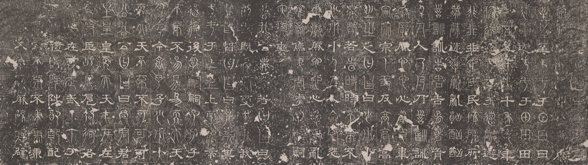
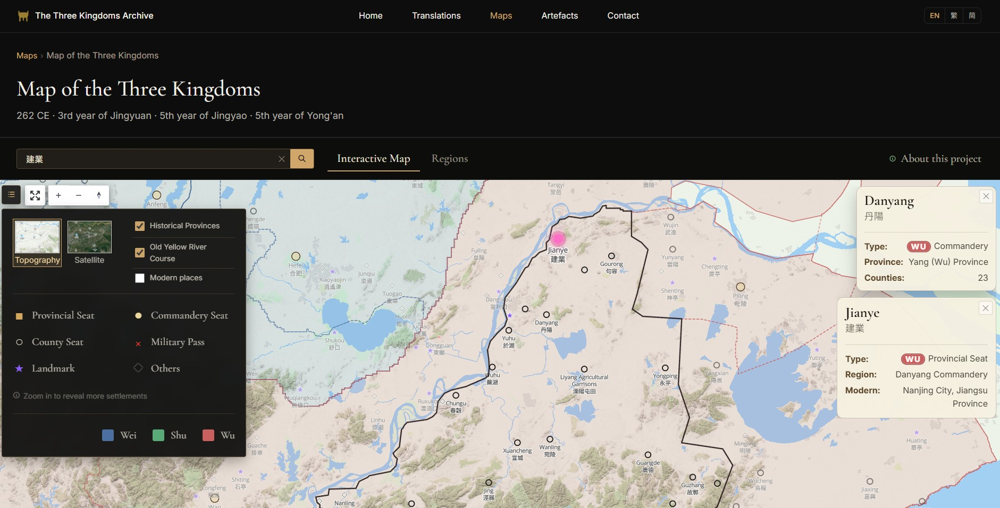
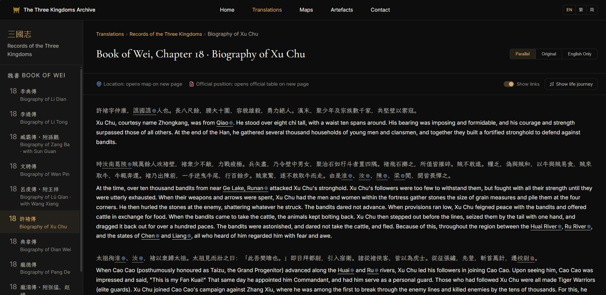
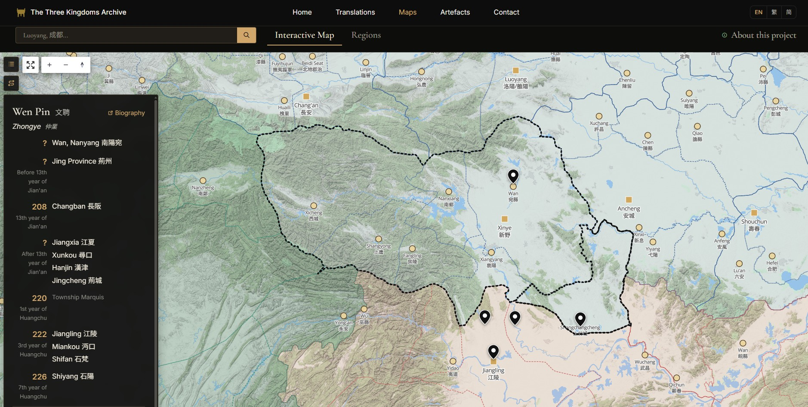
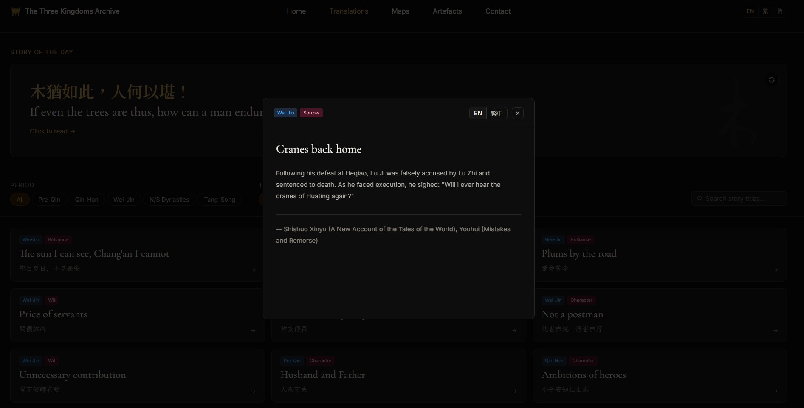
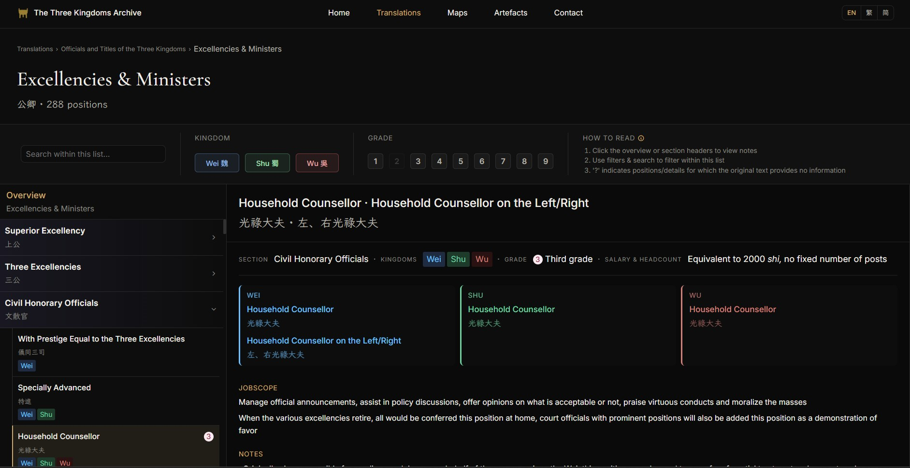
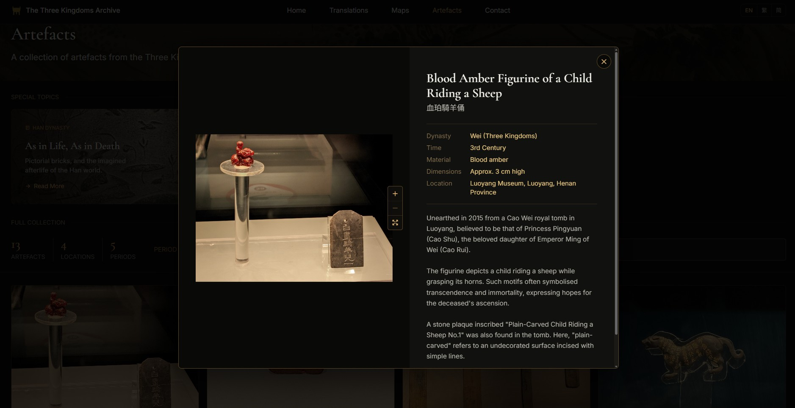

# The Three Kingdoms Archive · 三國叢匯
 
*An Archive of the Three Kingdoms and Beyond*

[![CC BY-NC-SA 4.0][cc-by-nc-sa-shield]][cc-by-nc-sa]

 
> *"Between Heaven and Earth, we are but passing travellers."*  
> — The Nineteen Old Poems, Han Dynasty

## About

A personal hobby project dedicated to the history, geography, and legacy of the Three Kingdoms period and its surrounding historical periods in ancient China.

This site primarily compiles personal maps, translations, and commentary, as well as relevant artefacts from various museums and sites.

## Current Features
 

<b>Interactive Map</b>

 

<b>Records of the Three Kingdoms (WIP)</b>

 

<b>Short Stories Collection</b>

 

 

<b>Three Kingdom Officials</b>

 

<b>Artefacts</b>

 

## Recent Updates
 
- Added interactive maps with settlement, province, commandery, and water bodies search
- Added historical journey for main characters in Records of the Three Kingdoms

See  for the full version history.

## License & Sources

[cc-by-nc-sa]: http://creativecommons.org/licenses/by-nc-sa/4.0/
[cc-by-nc-sa-image]: https://licensebuttons.net/l/by-nc-sa/4.0/88x31.png
[cc-by-nc-sa-shield]: https://img.shields.io/badge/License-CC%20BY--NC--SA%204.0-lightgrey.svg
 
Historical texts are cited where applicable.  
Artefact photographs remain the property of their respective institutions.
 
All images used on this site are my own, except for the following:
- Homepage Banner: [Wei Zhengshi Stone Classics (*Book of Documents*) Rubbing Reproduction, 魏正始石經《尚書》拓片複製品](https://museum.sinica.edu.tw/shop/item/85/)
- Translation Banner: [Rubbing of Han Dynasty Dragon Pictorial Stone, 漢墓室龍畫像石拓片](https://digitalarchive.npm.gov.tw/Collection/Detail/34995?dep=P)
- Artefact Banner: [Wang Xizhi Writing at the Orchid Pavilion (from *Illustrations of China's Famous Mountains*), 天下名山圖冊：晉王羲之寫蘭亭圖](https://digitalarchive.npm.gov.tw/Collection/Detail?id=12040&dep=P)
- Translation Project Icon: [Bronze seal with inscription "Wei shuaishan di baizhang", 「魏率善氐邑佰長」銅印](https://digitalarchive.npm.gov.tw/Collection/Detail/4123?dep=U)
- Translation Project Icon: [Gilt Bronze Guardian Lion, 銅鎏金護法獅](https://digitalarchive.npm.gov.tw/Collection/Detail/24761?dep=U)
- Official Table Icon: Luo Fuyi (羅福頤), Collected Official Seals of the Qin, Han, and Northern & Southern Dynasties (秦汉南北朝官印征存), 1987.

## Contributing
 
Currently a solo project. If you spot an error, have a correction, or want to get in touch:
 
- **Email**： zyugongjin@gmail.com
- **Discord**：heliogenesis  

If you enjoyed the archive and would like to support the project:

 

---
