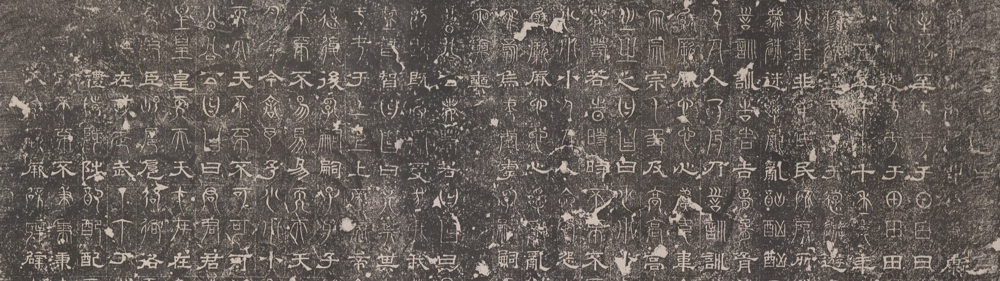
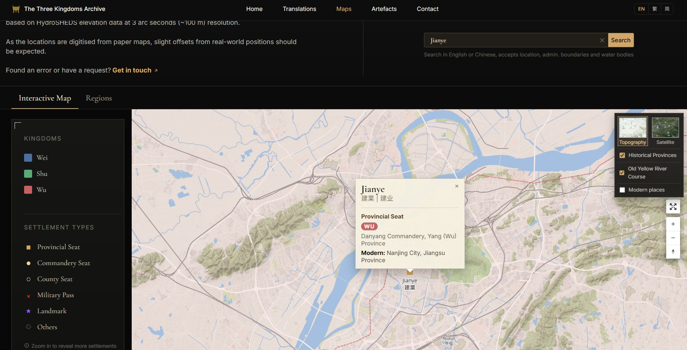
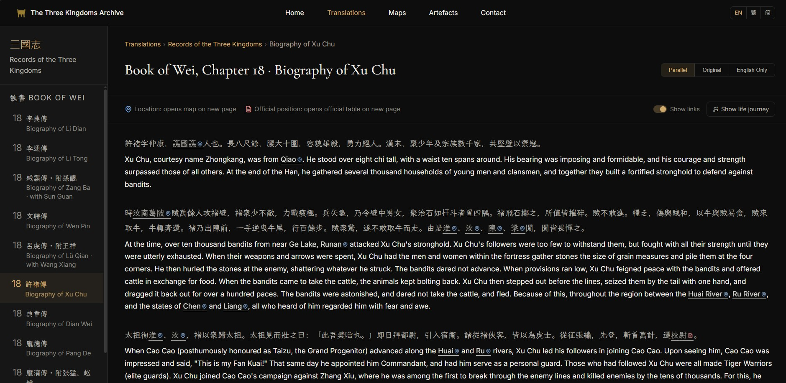
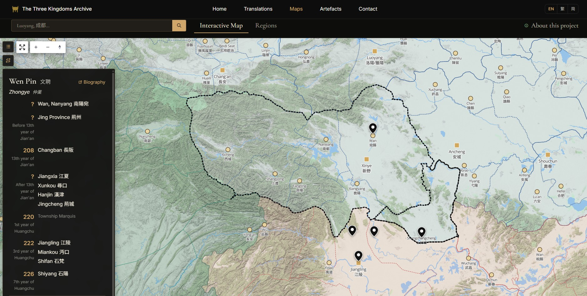
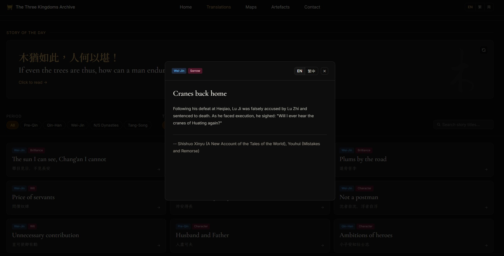
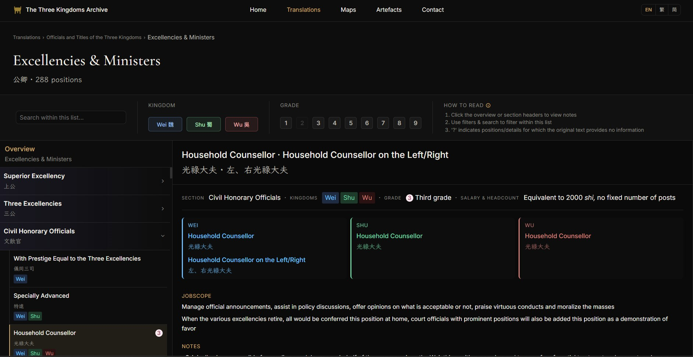
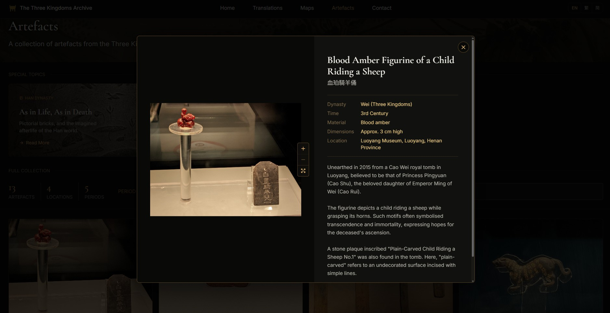

# The Three Kingdoms Archive · 三國叢匯
 
*An Archive of the Three Kingdoms and Beyond*

[![CC BY-NC-SA 4.0][cc-by-nc-sa-shield]][cc-by-nc-sa]

"Let us roam freely to our hearts’ desire, and may it ever be thus for a thousand years."  
 - Poem at a Banquet, Cao Zhi

 飄颻放志意，千秋長若斯
 - 曹植 · 《公讌詩》

## About · 關於

A personal hobby project dedicated to the history, geography, and legacy of the Three Kingdoms period and its surrounding historical periods in ancient China. It brings together artefacts, translations, maps, notes, and related resources, with the aim of making them easier to explore, reference, and revisit over time.

The archive is an ongoing work in progress. Materials may be revised, expanded, or reorganised as new sources are added and existing content is reviewed.

這是一個專注於中國古代三國前後歷史的個人興趣項目，匯集文物、譯文、地圖及相關資料。

仍在持續完善中。隨著不定期更新整合，相關内容可能會有修訂、補充或重新編排。

## Current Features · 現有内容
 

<b>Interactive Map | 互動地圖</b>

 

<b>Records of the Three Kingdoms | 三國志翻譯 (WIP)</b>

 

<b>Short Stories Collection | 短故事合集</b>

 

 

<b>Three Kingdom Officials | 三國職官表</b>

 

<b>Artefacts | 文物</b>

 

 
For full version history: 
 
更新詳情請見：

## Contributing | 參與
 
Currently a solo project. If you spot an error, have a correction, or want to get in touch:
 
若想合作、指正，或與我聯絡：

- **Email**： zyugongjin@gmail.com
- **Discord**：heliogenesis  

If you enjoyed the archive and would like to support the project:
 
如果你喜歡本站內容，並想支持這個項目：

 

## License & Sources · 授權與來源

[cc-by-nc-sa]: http://creativecommons.org/licenses/by-nc-sa/4.0/
[cc-by-nc-sa-image]: https://licensebuttons.net/l/by-nc-sa/4.0/88x31.png
[cc-by-nc-sa-shield]: https://img.shields.io/badge/License-CC%20BY--NC--SA%204.0-lightgrey.svg
 
Historical texts are cited where applicable.  
Artefact photographs remain the property of their respective institutions.
 
All images used on this site are my own, except for the following:
- Homepage Banner: [Wei Zhengshi Stone Classics (*Book of Documents*) Rubbing Reproduction, 魏正始石經《尚書》拓片複製品](https://museum.sinica.edu.tw/shop/item/85/)
- Translation Banner: [Rubbing of Han Dynasty Dragon Pictorial Stone, 漢墓室龍畫像石拓片](https://digitalarchive.npm.gov.tw/Collection/Detail/34995?dep=P)
- Artefact Banner: [Wang Xizhi Writing at the Orchid Pavilion (from *Illustrations of China's Famous Mountains*), 天下名山圖冊：晉王羲之寫蘭亭圖](https://digitalarchive.npm.gov.tw/Collection/Detail?id=12040&dep=P)
- Translation Project Icon: [Bronze seal with inscription "Wei shuaishan di baizhang", 「魏率善氐邑佰長」銅印](https://digitalarchive.npm.gov.tw/Collection/Detail/4123?dep=U)
- Translation Project Icon: [Gilt Bronze Guardian Lion, 銅鎏金護法獅](https://digitalarchive.npm.gov.tw/Collection/Detail/24761?dep=U)
- Official Table Icon: Luo Fuyi (羅福頤), Collected Official Seals of the Qin, Han, and Northern & Southern Dynasties (秦汉南北朝官印征存), 1987.

---
